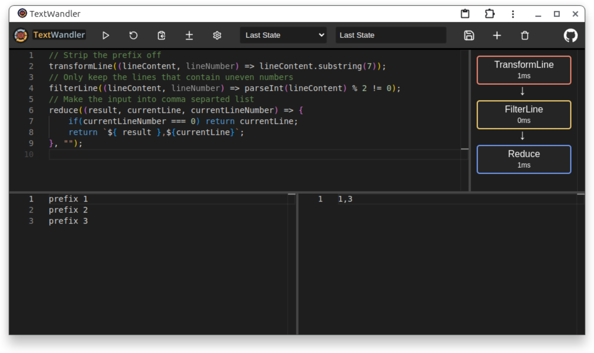
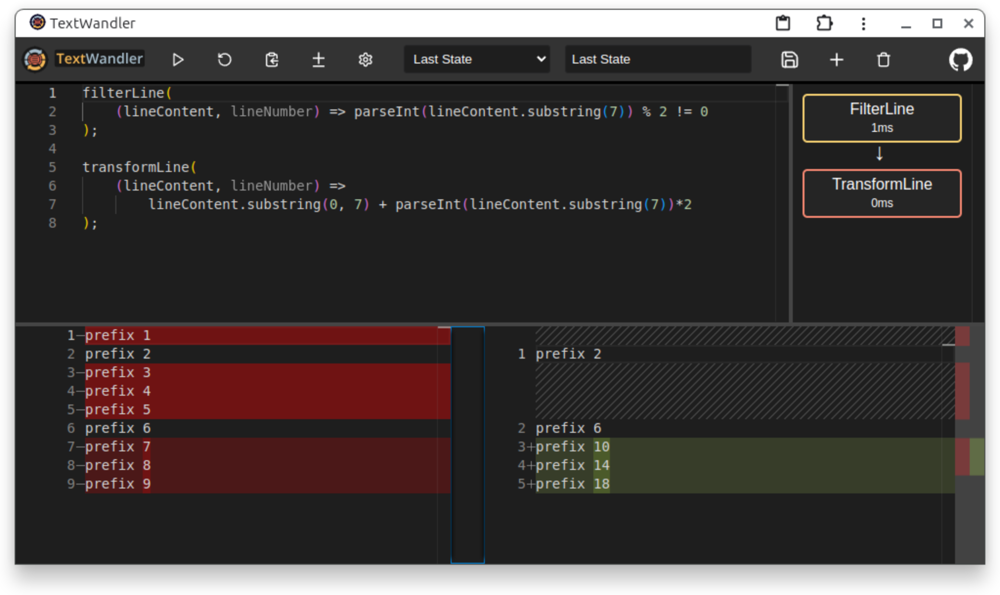

[](https://oliverthelen.github.io/textwandler/)

A crude local editor for transforming text input via JavaScript code.
You give it some text input, define how to manipulate the input via chainable functions that can be utilized alongside your own javascript code.
In the end the result will be written to the output editor.

The editor is for desktop use and might not work the best on mobile.
Can be accessed online [here](https://oliverthelen.github.io/textwandler/).
The editor can be installed as a PWA for local usage.

[](https://oliverthelen.github.io/textwandler/)

You can toggle between viewing the input and output as simple text or in a diff view between the two.

[](https://oliverthelen.github.io/textwandler/)

## Available functions

These are the integrated functions to interact with the input content and generate the final output.

### append

Adds a suffix to the end of each line. Useful for adding file extensions, punctuation, or completion markers.

```js
function append(suffix: string): void
```

```js
// Add checkmark to completed tasks
append(' ✓');

// Add semicolons to statements
append(';');

// Add file extensions
append('.txt');

// Add closing tags
append('</li>');
```

### filterLine

Iterates over every line of the input and only keeps those lines for which the callback returns true.

```js
function filterLine(callback: (lineContent: string, lineNumber: number) => boolean): void
```

```js
// Keeps every second line from the input
filterLine((lineContent, lineNumber) => lineNumber % 2 === 0);
```

### transformLine

Iterates over every line of the input and puts the result of the callback into the output in its place.

```js
function transformLine(callback: (lineContent: string, lineNumber: number) => string): void
```

```js
// Prefixes every line with the lineNumber
transformLine((lineContent, lineNumber) => `${lineNumber} ${lineContent}`);
```

### reduce

Iterates over every line and gives it to the provided callback. In the end the result of the last callback execution is stringified and written to the output.

```js
function reduce(
    callback: (
        result: any,
        currentLine: string,
        currentLineNumber: number,
        inputLinesArray: string[]
    ) => any,
    initialValue?: any
): void
```

```js
// Parses every line from the input as a number and calculates the sum as the output
reduce((result, line) => {
    if (parseInt(line)) {
        result += parseInt(line);
    }
    return result;
}, 0);
```

### unique

Filters all lines and leaves only unique ones as a result for the next stage

```js
function unique(): void
```

```js
unique();
```

### setValue

Allows to set the whole output to the result of the callback which gets the results of the previous function chain as the input.

```js
function setValue((input: string) => string): void
```

```js
setValue(() => 'set the output to this string\nnext line');
```

### jsonParse

Parses the input as a json object or array and allows the manipulation in the callback.
Result of the callback must be a json object or array again.

```js
function jsonParse((input: object | array) => object | array): void
```

```js
// Assumes as input an object like: {"a": 123}
jsonParse((json) => {
    json.a++;
    return json;
});
// Output will be:
// {
//    "a": 124
// }
```

## Chaining of functions

The result of the last function that is executed in the code editor will be written to the output.
Only the first function that is executed reads the original input every subsequent functions reads the input from the previous function.

As an example look at the following input for the code editor and see how it transforms the text input.

```js
// Strip the prefix off
transformLine((lineContent, lineNumber) => lineContent.substring(7));
// Only keep the lines that contain uneven numbers
filterLine((lineContent, lineNumber) => parseInt(lineContent) % 2 != 0);
// Transform the input into a comma separated list
reduce((result, currentLine, currentLineNumber) => {
    if (currentLineNumber === 0) return currentLine;
    return `${result},${currentLine}`;
}, '');
```

Initial input

```
prefix 1
prefix 2
prefix 3
```

After executing the `transformLine`

```
1
2
3
```

After executing the `filterLine`

```
1
3
```

After executing the `reduce`

```
1,3
```

## Additional imports

### lodash

It is possible to use lodash functions in your code as the full lodash is available.

```js
transformLine((lineContent) => _.snakeCase(lineContent));
```
